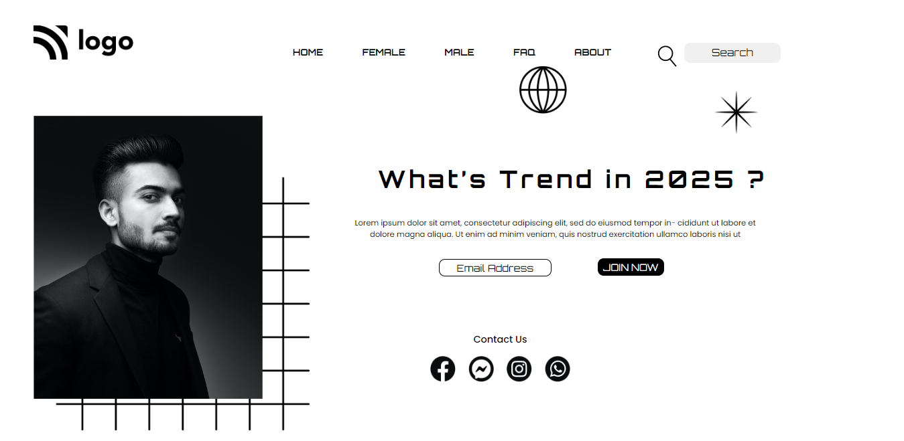

# First Ever Website in pure HTML and CSS
---
## Description 
The first ever project under the guidance of Hitesh Chaudhary sir. The overall time took to complete this project was around `12-15 hours`. The duration to complete a single static page is ideally 3-4 hours but I have added an extra efforts to understand the complete concepts such as [CSS Selectors](https://xadai.hashnode.dev/css-selectors-no-confusion-anymore), [CSS Positions](https://xadai.hashnode.dev/css-layout-a-detailed-guide-to-css-positions), and [Basic HTML Tags](https://xadai.hashnode.dev/basic-html-tags-developers-should-know-from-day-1).

---
<!-- PROJECT LOGO -->
 

  

<h3 align="center">Project 01</h3>

  
   
    <a href="https://harshalverma-project01.netlify.app/">View Live Demo</a>
  

<!-- ABOUT THE PROJECT -->

## About The Project

Here's a Screen-Shot of my first project and I learnt Most of my usefull Future of `HTML` and `CSS`.
 
 

## Built With

**Using Technologies**

1. `HTML`
2. `CSS`
3. `MarkDown`

> The challenge of this project was to design the page as it is from scratch with pure CSS without using any frameworks.

 

## Live Project

This project is presently deployed in **`Netlify Service`**.

[Live Project URL](https://harshalverma-project01.netlify.app)
 

<!-- LEARNT -->
 

## Learnt
In This project I learnt not about just HTML & CSS properties but designing aspects, ratios, image editing and many more.
- HTML 5
- CSS 3
  - CSS Selectors
  - CSS Positioning
  - CSS Z index

 
<!-- CONTACT -->

## Contact

- **Name 👨‍💻:** [Harshal Verma](https://github.com/harshalvrm)
- **Email 📧:** [harshalvrm3@gmail.com](mailto:harshalvrm3@gmail.com)
- **Blog 📝:** [Hashnode blog](https://xadai.hashnode.dev/)

[Project 1 Link](https://harshalverma-project01.netlify.app)

